<h1 align="center">Map of Middle-Earth</h1>

<p align="center">
  <b>A cinematic floating miniature of Middle-earth, rendered with three.js WebGPU,<br>
  and the world of the short film <i>Journey Through Middle-Earth</i>.</b>
</p>

<p align="center">
  <a href="LICENSE"></a>
  <a href="https://threejs.org"></a>
  <a href="https://www.w3.org/TR/webgpu/"></a>
  <a href="tsconfig.json"></a>
</p>

<!-- FILM: replace the placeholder below with the film when it is published.
     Inline player: drag the mp4 (≤ 10 MB teaser) into this file in GitHub's web editor; the generated
     https://github.com/user-attachments/assets/<id> URL, alone on its own line, renders as a video player.
     Full film elsewhere (YouTube …): a poster linking to it, e.g.
     <a href="<film url>"></a> -->
<p align="center">
  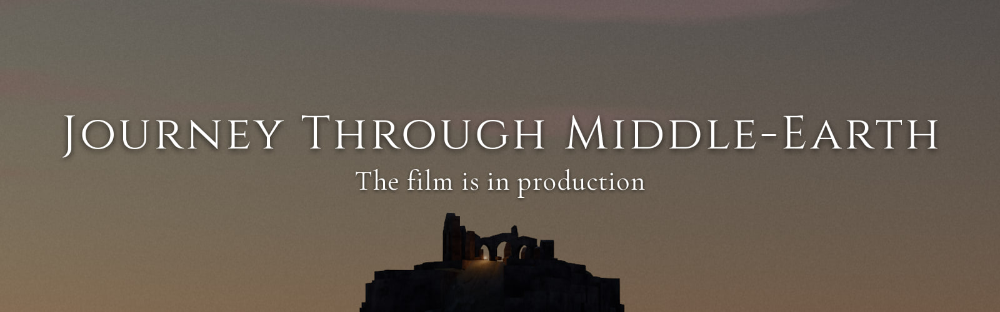
</p>

<p align="center">
  <a href="docs/images/hero-golden-hour.jpg">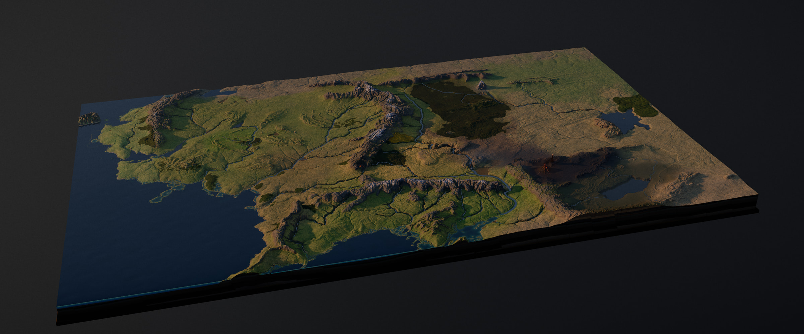</a>
  <br><sub>The map at golden hour: 1,600 × 960 km of Middle-earth on a floating slab, rendered in the browser.</sub>
</p>

A miniature Middle-earth that you can fly over, from the Grey Havens to Mount Doom. The terrain is built from
community GIS data, 24 landmarks are modelled in code, and the sky, water, smoke and light are all rendered
live: nothing is pre-rendered. It runs in the browser with three.js WebGPU, and the film will be captured
from it frame by frame. The look aims at the bigatures of Peter Jackson's films: a physical model under real
light, never a toy.

**Status:** the static world is complete and locked (`v0.5.0`). The film is in production: Frodo's road
from the Shire to Mount Doom, with a luminous route line, title cards and an original score.

## Gallery

<p align="center">
  <a href="docs/images/erebor.jpg">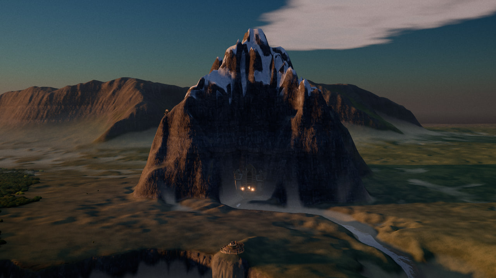</a>
  <a href="docs/images/lake-town.jpg">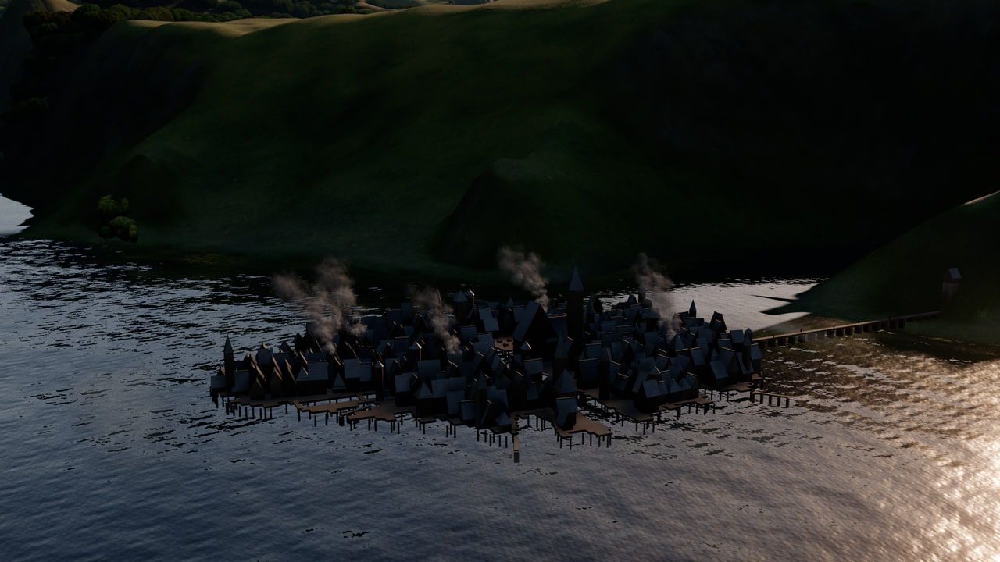</a>
  <a href="docs/images/hobbiton.jpg">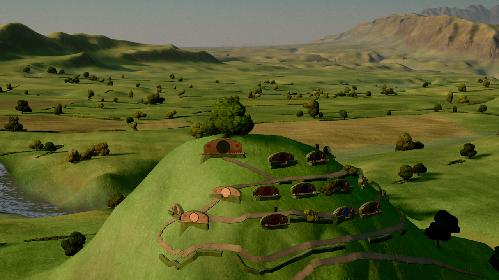</a>
  <br><sub><b>Erebor</b> · <b>Lake-town</b> · <b>Hobbiton</b></sub>
</p>
<br>
<p align="center">
  <a href="docs/images/moria.jpg">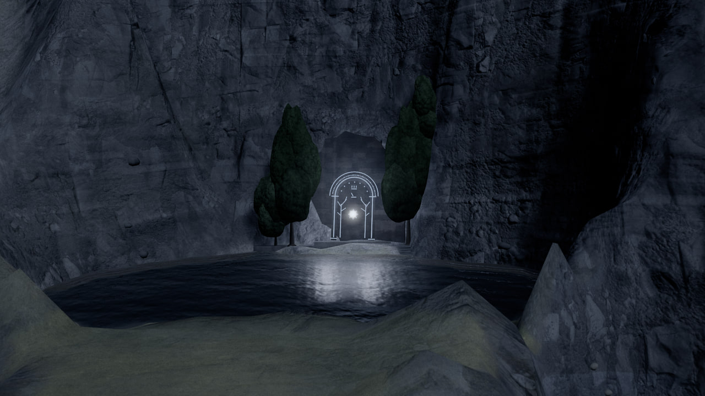</a>
  <a href="docs/images/lothlorien.jpg">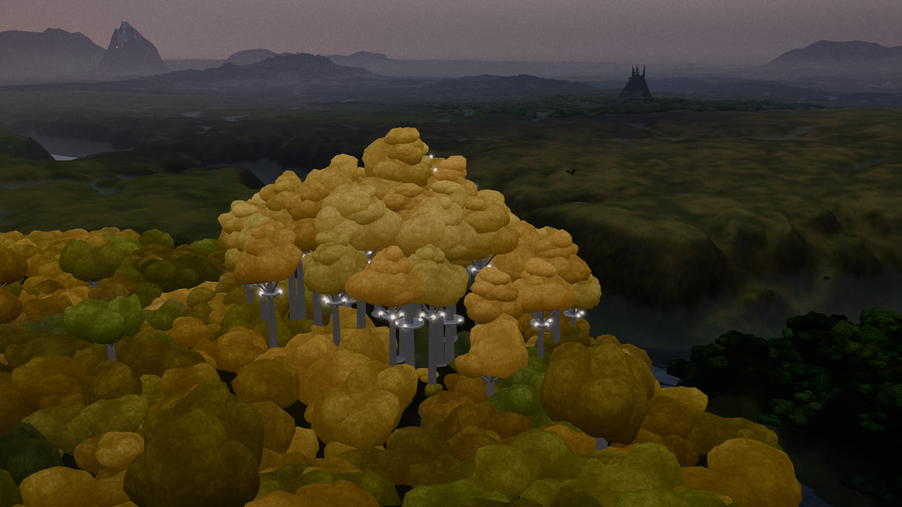</a>
  <a href="docs/images/argonath.jpg">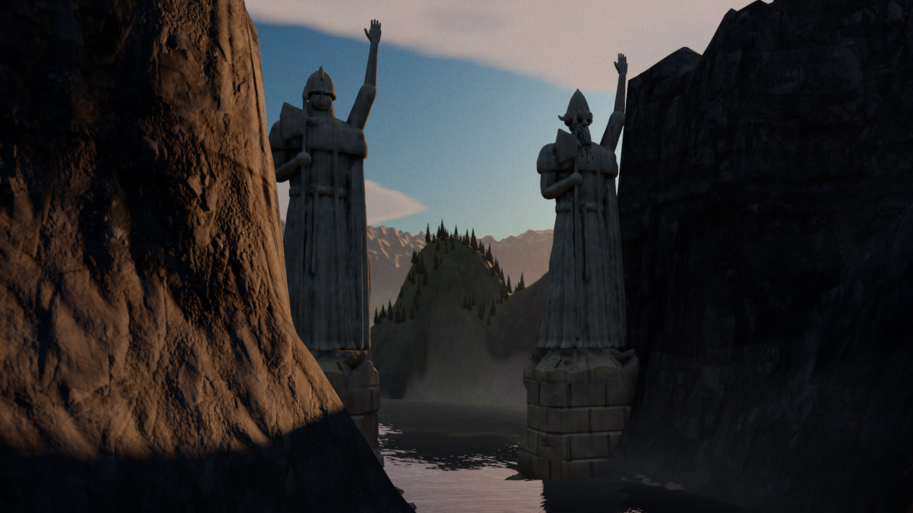</a>
  <br><sub><b>The Doors of Durin</b> · <b>Lothlórien</b> · <b>The Argonath</b></sub>
</p>
<br>
<p align="center">
  <a href="docs/images/minas-morgul.jpg">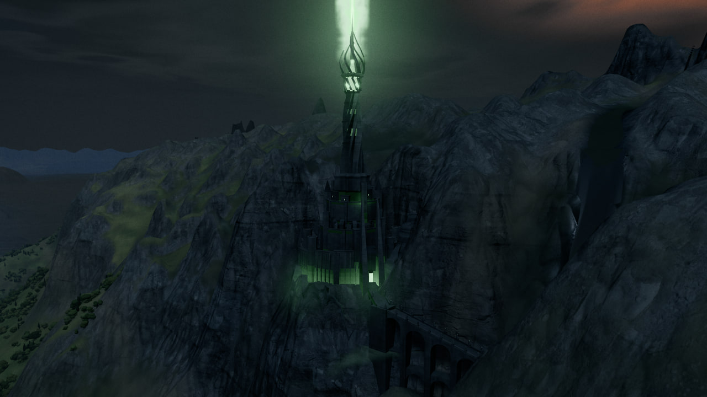</a>
  <a href="docs/images/black-gate.jpg">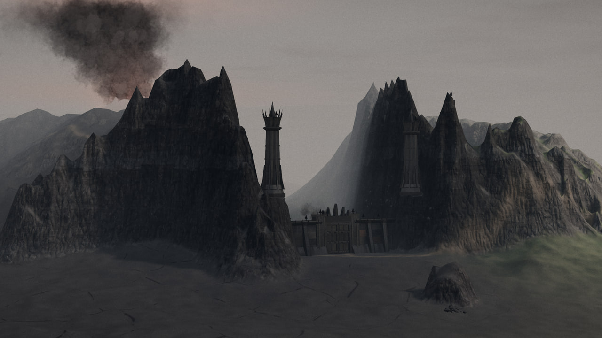</a>
  <a href="docs/images/mount-doom.jpg">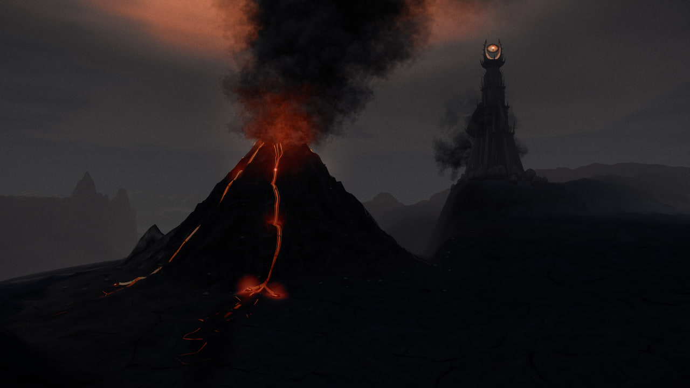</a>
  <br><sub><b>Minas Morgul</b> · <b>The Black Gate</b> · <b>Mount Doom</b></sub>
</p>

## Day and night

<p align="center">
  <a href="docs/images/pair-map.jpg">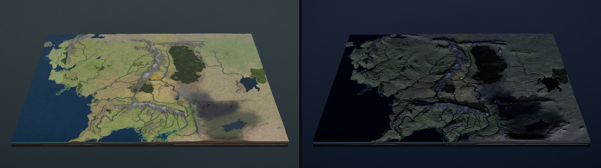</a>
  <br><sub><b>The map</b>: 11:00 and 23:00, settlement lights and Mordor's fires under the moon.</sub>
</p>
<p align="center">
  <a href="docs/images/pair-minas-tirith.jpg">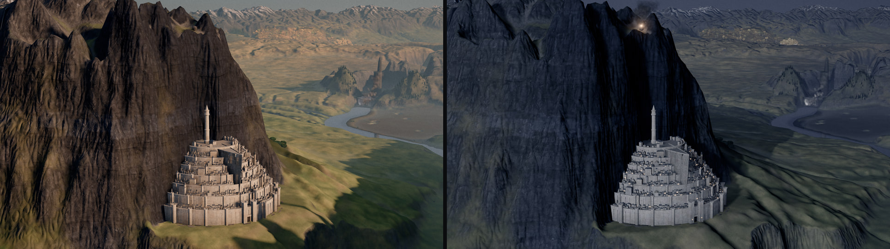</a>
  <br><sub><b>Minas Tirith</b>: early morning, and the beacon lit on Mindolluin.</sub>
</p>
<p align="center">
  <a href="docs/images/pair-rivendell.jpg">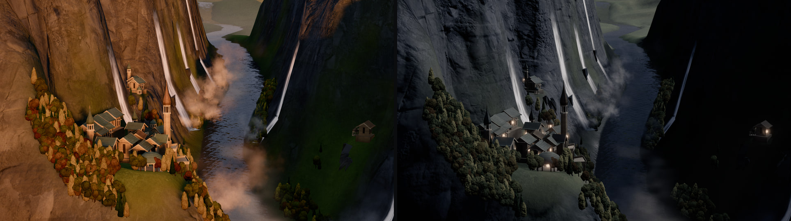</a>
  <br><sub><b>Rivendell</b>: an October afternoon, and a full moon over the gorge.</sub>
</p>

## Highlights

- **Real geography.** Coastlines, rivers, lakes and relief come from the ME-DEM elevation model and the
  ME-GIS vector layers. A Python bake snaps rivers to their valleys, solves lake levels and derives the
  landcover. Heights are exaggerated, as on a relief model, and the world sits on a floating slab.
- **24 landmarks**, from Hobbiton to Barad-dûr. Each one is declared once: terrain stamps, procedural
  architecture from a shared TypeScript kit (plus one Blender-generated model, the Argonath), lights, trees,
  emitters and camera bookmarks. Shared systems turn those declarations into the scene.
- **Atmosphere and grade.** Regional haze and colour grades, cumulus and cloud shadows, valley mist, a
  moonlit night sky, and an ash pall over Mordor lit red from below by Mount Doom.
- **Surfaces.** A layered terrain material (strata, scree, snow, volcanic crust and lava), tree crown
  archetypes from broadleaf and conifer to holly and shrub with a far canopy shell, rivers and lakes with
  reflections, and weathered stone, timber and roofs.
- **Light that lights things.** Lava, beacons, braziers, the Morgul beam and the glow of whole settlements
  spill light onto the rock, water and foliage around them.
- **Stateless effects.** Plumes, waterfalls, spray, mist and sparks are driven by an effect clock, never by
  simulation history, so any frame of the film can be rendered on its own.
- **Offline quality, deterministic frames.** Every frame is a pure function of a scene state. Stills and
  film frames use jittered multi-sample accumulation, subtle depth of field on close heroes, halation, a
  film grade and grain, and they are bit-identical from run to run on the same browser and GPU driver.
- **QA built in.** Headless capture through Chrome's WebGPU readback, pixel-hash locks, a CPU camera probe
  with framing gates, blind A/B reviews and a performance gate for the real-time preview.

## How it works

Third-party data is baked once into a deterministic world. Landmarks only *declare* what they need, and a
small set of shared systems realizes it. A timeline turns time into a complete `SceneState`, and the
renderer turns that state into pixels: in the interactive explorer, or accumulated offline for stills and
film frames.

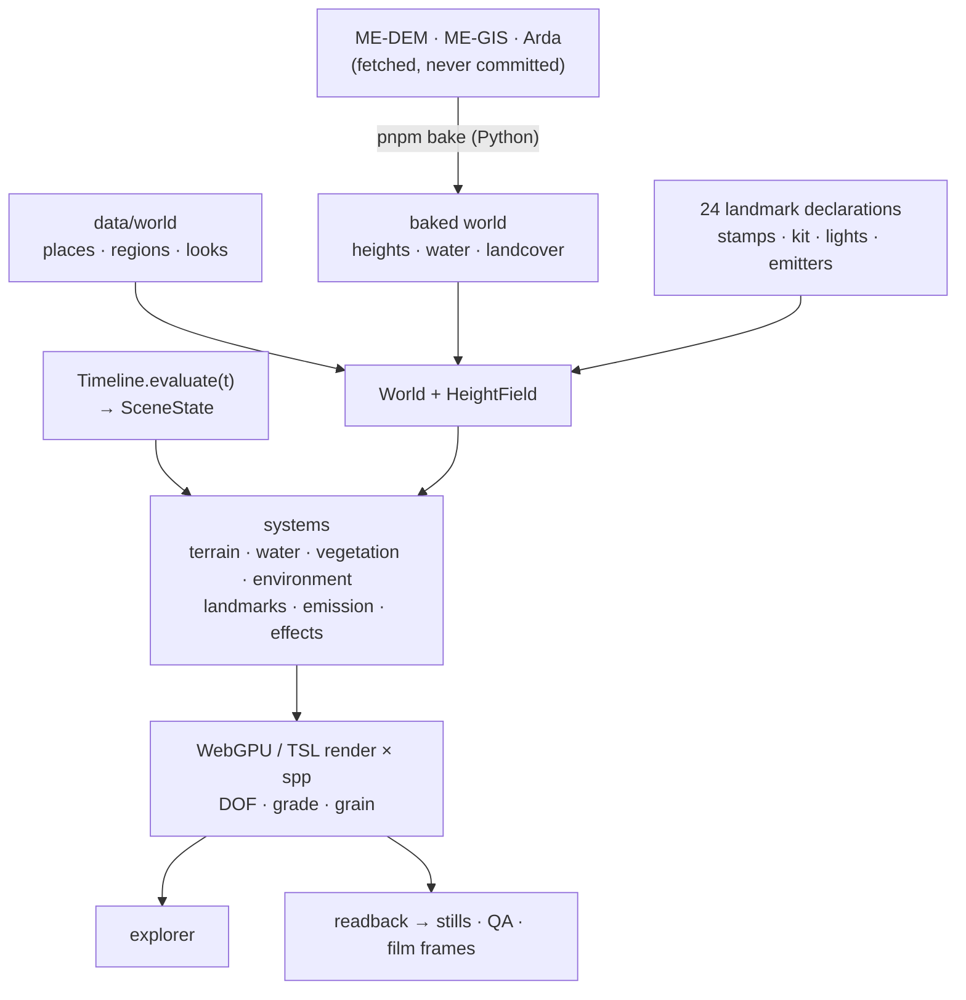

The contracts are in [`docs/ARCHITECTURE.md`](docs/ARCHITECTURE.md). The roadmap and the current state are
in [`docs/PROJECT_STATE.md`](docs/PROJECT_STATE.md).

| Path | What lives there |
|:---|:---|
| `src/` | the renderer: core / timeline, world services, terrain, water, vegetation, environment, landmarks, emission, effects, materials, diorama slab, camera, render (post, capture) |
| `tools/` | the Python bake, capture / QA / review, checks and the camera probe, Blender model scripts |
| `data/world`, `data/tour`, `data/qa` | authored world data, the film's route and shot list, QA shots / sets / locks |
| `docs/` | architecture, project state, early research briefs, README images |

## Running it

You need **Google Chrome** with hardware WebGPU (the capture tools drive the installed Chrome; other WebGPU
browsers are untested for the explorer), **Node 24** (≥ 22.12), **pnpm 11** (`corepack enable` picks the
pinned version) and [uv](https://docs.astral.sh/uv/) for the Python bake. Allow about 2.5 GB of disk for
the data, the bake and its Python environment. Blender 4.5 is only needed to rebuild the Argonath model,
which is committed (`pnpm models`; set `MOME_BLENDER` to its binary off Windows).

```bash
pnpm install
pnpm data:fetch   # ≈ 1.2 GB of source data and CC0 textures (their own terms)
pnpm bake         # builds data/baked (Python 3.12 via uv)
pnpm dev          # explorer at localhost:5173 (?quality=review|final)
pnpm shots --shot minas-tirith-close --quality final --spp 12   # a still
```

The explorer and the captures need the fetched data and the bake; there is no prebuilt world. The explorer
has orbit controls and a panel for the QA shots and landmark bookmarks, time of day, day of the year (sun
and moon), field of view and exposure. Stills are written to `renders/shots/latest/` (1920×1080 by
default). `pnpm typecheck` and `pnpm check` run without any third-party data (without a bake, `pnpm check`
skips the world, landmark and bookmark gates).

The project was developed on a Windows 11 laptop with 8 GB of RAM and an Intel UHD iGPU, and the real-time
preview tier is tuned for that machine. The capture, bake and QA tooling (GPU job lock, memory guard) is
written for and tested on Windows. The bake and captures first wait for free RAM (2.5 / 1.8 GB); if they
wait in vain (e.g. on macOS, where Node under-reports free memory), set `MOME_MEM_GUARD=0`.

## Roadmap

| | Session | Status |
|:--|:---|:--:|
| 1 | Foundation and geography: world data, systems, capture and QA | ✅ |
| 2 | World look: bake v2, atmosphere, regional grades, terrain and vegetation | ✅ |
| 3 | All 24 landmarks: kit, stamps, emission, Blender pipeline | ✅ |
| 4 | Look and still effects: sky, night, water, effects, lens and grade, hero polish | ✅ |
| 4.5 | Static world locked (`v0.5.0`), README, repository polish | ✅ |
| 5 | The journey: timeline and animatic, route line, title cards, original score | next |
| 6 | Final render (1080p24), release | |

## Credits

The geography comes from the **ME-DEM** project of the Outerra Worlds Forum (elevation model by monks and
Redrobes, place names by monks, SeerBlue and Redrobes, later maintained by jvangeld), the **ME-GIS** vector
layers created for ME-DEM by monks and SeerBlue and improved by jvangeld
([andrewheiss/ME-GIS](https://github.com/andrewheiss/ME-GIS)), and the **Arda** packaging by bburns, with
the GeoPackage conversion by tetrakai1 ([bburns/Arda](https://github.com/bburns/Arda)). The data authors
are being asked for their blessing for this use. Terrain detail textures are from
[Poly Haven](https://polyhaven.com) (CC0). The fonts are Cinzel, Cinzel Decorative, Cormorant Garamond,
EB Garamond, IM Fell English and IM Fell English SC (SIL OFL 1.1). The project is built with
[three.js](https://threejs.org), [Vite](https://vite.dev), TypeScript, [Playwright](https://playwright.dev),
[sharp](https://sharp.pixelplumbing.com) and [Blender](https://www.blender.org). Every asset and source is
listed in [`CREDITS.md`](CREDITS.md).

## License

- **Code and original models** (`public/models`): [MIT](LICENSE).
- **Fonts**: SIL Open Font License 1.1 (each family's `OFL.txt` sits in `public/fonts/`).
- **Third-party geographic data** is not part of this repository. `pnpm data:fetch` downloads it from the
  authors' repositories, and their terms apply: ME-GIS asks users to request permission before use, and the
  licence of the Arda DEM and vectors is uncertain.
- **Renders** (`docs/images/`) show terrain derived from that data. They are not covered by the MIT licence
  and no reuse licence is granted; they are here to illustrate the project.

## Disclaimer

A non-commercial fan project. It is not affiliated with or endorsed by the Tolkien Estate, Middle-earth
Enterprises, HarperCollins, New Line Cinema, Warner Bros., Wētā Workshop, or any data author, font designer
or artist credited in [`CREDITS.md`](CREDITS.md). *The Lord of the Rings*, *The Hobbit* and Middle-earth are
trademarks of their respective owners. The project contains no film footage, artwork, logos or typography
from the films, no Tengwar or Cirth, and its music is original.
